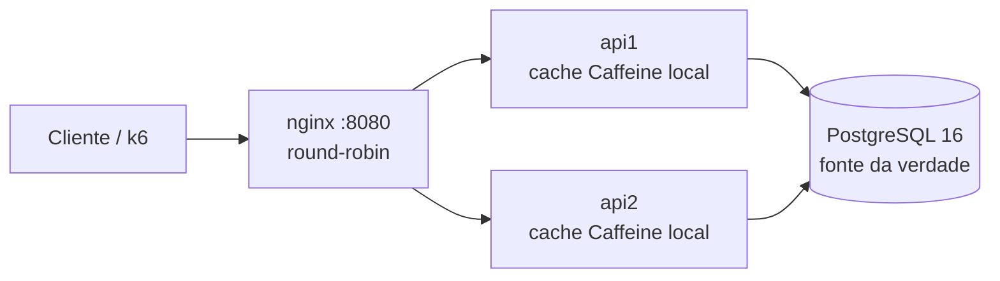
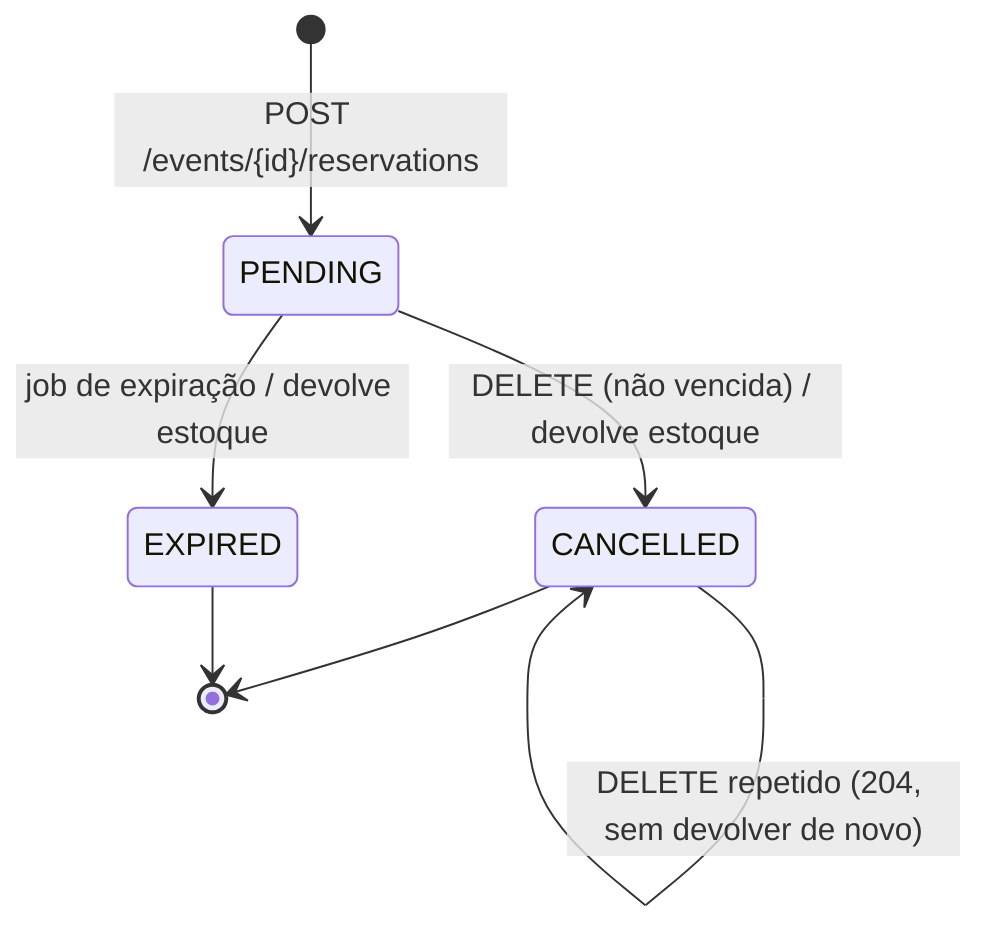

# Flash Booking

API de reservas de ingressos para eventos de alta demanda ("flash sales"). Garante **zero oversell** com múltiplas instâncias da API, **idempotência** na criação de reservas, **expiração automática** de reservas pendentes e **erros explícitos** (RFC 7807). Toda regra crítica vive no PostgreSQL; nenhuma decisão depende da memória de uma instância.

Stack: Java 21, Spring Boot 3.3, PostgreSQL 16, MyBatis (SQL explícito em XML), Flyway, Caffeine, springdoc-openapi (Swagger UI), Actuator + Micrometer, Testcontainers, k6, nginx.

Princípio de projeto: menos infraestrutura, mais solidez. Sem Kafka, Redis, Outbox ou JPA (ver [Decisões](#6-decisões-arquiteturais) e [Evoluções](#11-evoluções-futuras-e-limitações-conhecidas)).

## Sumário

1. [Visão geral e diagramas](#1-visão-geral-e-diagramas)
2. [Como rodar](#2-como-rodar)
3. [Como testar](#3-como-testar)
4. [Contrato da API](#4-contrato-da-api)
5. [Fluxos críticos](#5-fluxos-críticos)
6. [Decisões arquiteturais](#6-decisões-arquiteturais)
7. [Premissas](#7-premissas)
8. [Configuração](#8-configuração)
9. [Estrutura do projeto e observabilidade](#9-estrutura-do-projeto-e-observabilidade)
10. [Perguntas prováveis e defesa técnica](#10-perguntas-prováveis-e-defesa-técnica)
11. [Evoluções futuras e limitações conhecidas](#11-evoluções-futuras-e-limitações-conhecidas)

---

## 1. Visão geral e diagramas

### Arquitetura

Monólito único (um artefato, organizado por camadas), executado em duas instâncias atrás de um nginx com round-robin. O PostgreSQL é a fonte da verdade. O cache Caffeine é local a cada instância e é usado **somente** em `GET /events/{id}`; a escrita nunca consulta cache.



### Criação de reserva (`POST /events/{id}/reservations`)

Ordem exata dos passos dentro da transação. O `UPDATE` do estoque (linha quente) é a **última** operação antes do `COMMIT`, para segurar o lock pelo menor tempo possível. Se não há estoque, tudo é desfeito (reserva, histórico e chave de idempotência).

```mermaid
sequenceDiagram
    autonumber
    participant C as Cliente
    participant API as API (ReservationService)
    participant DB as PostgreSQL

    C->>API: POST /events/{id}/reservations (Idempotency-Key, quantity)
    API->>API: valida header e body, calcula request_hash (fora da tx)
    API->>DB: BEGIN + lock_timeout / statement_timeout (local à tx)
    API->>DB: INSERT idempotency_keys (key, hash) ON CONFLICT DO NOTHING
    alt 0 linhas (chave já existe; o INSERT esperou a tx concorrente)
        API->>DB: SELECT da chave
        alt hash diferente
            API-->>C: 409 IDEMPOTENCY_KEY_CONFLICT
        else hash igual
            API->>DB: ROLLBACK
            API-->>C: status e corpo salvos + Idempotent-Replayed: true
        end
    else 1 linha (venceu a disputa)
        API->>DB: INSERT reservations (PENDING, expires_at = NOW() + TTL) RETURNING
        Note over API,DB: violação de FK (23503) => 404 EVENT_NOT_FOUND
        API->>DB: INSERT reservation_history (CREATED)
        API->>DB: UPDATE idempotency_keys SET http_status, response_json
        API->>DB: UPDATE events SET available = available - q WHERE id AND available >= q
        alt 0 linhas (sem estoque)
            API->>DB: ROLLBACK
            API-->>C: 409 INSUFFICIENT_CAPACITY
        else 1 linha
            API->>DB: COMMIT
            API-->>C: 201 + Location
        end
    end
```

### Estados da reserva

Não existe `CONFIRMED` (o enunciado não define confirmação ou pagamento). Toda reserva nasce `PENDING` e termina `CANCELLED` ou `EXPIRED`.



---

## 2. Como rodar

Pré-requisito: Docker (com Docker Compose).

**1. Crie o arquivo de credenciais.** Todas as senhas e variáveis ficam em `credencias.env`, que **não é versionado** (está no `.gitignore`). O repositório traz o modelo `credencias.env.example`:

```bash
cp credencias.env.example credencias.env
```

Edite `credencias.env` e troque `POSTGRES_PASSWORD` por uma senha sua. Sem esse arquivo, o `docker compose` falha com "env file not found".

**2. Suba a stack:**

```bash
docker compose up --build
```

Sobe `postgres` (com healthcheck), `api1` e `api2` (mesma imagem, `INSTANCE_ID` diferente, migrations Flyway automáticas) e `nginx` (porta 8080). As APIs só sobem depois que o Postgres está saudável; o nginx só depois que ambas estão saudáveis.

| Recurso | URL |
|---|---|
| API (via nginx) | http://localhost:8080 |
| Swagger UI | http://localhost:8080/swagger-ui.html |
| Health | http://localhost:8080/actuator/health |
| Métricas | http://localhost:8080/actuator/metrics |

### Fluxo de exemplo com curl

Criar um evento:

```bash
curl -i -X POST http://localhost:8080/events -H "Content-Type: application/json" -d '{"name":"Java Festival","capacity":50}'
```

Guarde o `id` retornado (`EVENT_ID`). Reservar com `Idempotency-Key`:

```bash
curl -i -X POST http://localhost:8080/events/$EVENT_ID/reservations -H "Content-Type: application/json" -H "Idempotency-Key: demo-key-001" -d '{"quantity":2}'
```

Repetir exatamente a mesma chamada (replay): mesmo status e mesmo corpo, com o header `Idempotent-Replayed: true`:

```bash
curl -i -X POST http://localhost:8080/events/$EVENT_ID/reservations -H "Content-Type: application/json" -H "Idempotency-Key: demo-key-001" -d '{"quantity":2}'
```

Mesma chave com outro payload retorna `409 IDEMPOTENCY_KEY_CONFLICT`:

```bash
curl -i -X POST http://localhost:8080/events/$EVENT_ID/reservations -H "Content-Type: application/json" -H "Idempotency-Key: demo-key-001" -d '{"quantity":3}'
```

Consultar a reserva (`RESERVATION_ID` vem da resposta do POST):

```bash
curl -i http://localhost:8080/reservations/$RESERVATION_ID
```

Cancelar (204; repetir também retorna 204 sem devolver estoque de novo):

```bash
curl -i -X DELETE http://localhost:8080/reservations/$RESERVATION_ID
```

Consultar o evento (a disponibilidade pode levar cerca de 1s para refletir, por causa do cache local):

```bash
curl -i http://localhost:8080/events/$EVENT_ID
```

O header `X-Instance-Id` de cada resposta mostra qual instância atendeu (`api1` ou `api2`).

### requests.http

O arquivo `requests.http` na raiz contém o mesmo roteiro (mais casos de erro de validação, health e métricas), compatível com o HTTP Client do JetBrains e com a extensão REST Client do VS Code. Execute os requests em ordem.

---

## 3. Como testar

### Testes automatizados

```bash
./mvnw verify
```

Requer JDK 21 e Docker (os testes de integração usam Testcontainers com um PostgreSQL 16 real, compartilhado entre as classes de teste).

Sem JDK local, é possível rodar a suíte dentro do container `maven`, expondo o `docker.sock` ao Testcontainers (comando validado neste projeto, com o repositório como diretório atual):

```bash
docker run --rm -v /var/run/docker.sock:/var/run/docker.sock -v "$PWD":/workspace -w /workspace -e TESTCONTAINERS_HOST_OVERRIDE=host.docker.internal maven:3.9-eclipse-temurin-21 mvn verify
```

`TESTCONTAINERS_HOST_OVERRIDE` faz o Testcontainers, rodando dentro do container, alcançar as portas do Postgres publicadas no host do Docker. Em Linux nativo pode ser necessário adicionar `--add-host=host.docker.internal:host-gateway`.

**Nota sobre a versão do Testcontainers:** o `pom.xml` fixa `testcontainers.version` em `1.21.4`. O Docker Engine 29+ recusa clientes de API antigos, e a versão gerenciada pelo Spring Boot 3.3 (1.19.x) não consegue se conectar a ele.

### O que cada suíte prova

| Suíte | O que prova |
|---|---|
| `ReservationConcurrencyTest` | 200 requisições HTTP simultâneas, `quantity=1`, chaves distintas, evento com capacidade 50: exatamente 50 respostas 201 e 150 respostas 409, `available = 0` (zero oversell) |
| `ReservationApiTest` | Fluxo feliz (reserva, decremento de estoque, histórico `CREATED`); replay devolve a mesma resposta com `Idempotent-Replayed` e não escreve de novo; **20 requisições concorrentes com a mesma chave** geram uma única reserva; mesma chave com outra quantidade ou outro evento retorna `IDEMPOTENCY_KEY_CONFLICT`; erro de negócio (sem estoque) **não retém a chave**; evento inexistente retorna 404 sem deixar resíduo; validações (header, quantidade, UUID, JSON); `GET` de reserva vencida reporta `EXPIRED` sem devolver estoque |
| `ReservationCancelTest` | Cancelamento devolve estoque e grava histórico; `DELETE` repetido devolve estoque uma única vez (inclusive 20 `DELETE` concorrentes); `DELETE` de reserva `PENDING` já vencida ou `EXPIRED` retorna 409 sem alterar nada; 404 e 400; 30 cancelamentos paralelos mantêm a invariante |
| `ReservationExpirationTest` | O lote expira só reservas vencidas, devolve estoque e grava uma linha de histórico por transição efetiva; `expireAll` drena vários lotes até o limite de iterações |
| `ReservationExpirationConcurrencyTest` | **Expiração concorrente** (dois lotes em paralelo expiram cada reserva uma vez e devolvem o estoque uma vez; instâncias dividem o trabalho via `SKIP LOCKED`); **lotes mistos entre eventos** sem deadlock; **cancelamento x expiração** na mesma reserva (inclusive exatamente na fronteira `expires_at`) devolvem estoque uma única vez |
| `ReservationExpirationJobTest` | O job `@Scheduled` expira e devolve estoque sem chamada manual |
| `EventApiTest`, `EventCacheTest` | Contrato e validações de eventos, headers de correlação e instância; o cache serve o valor antigo dentro do TTL e converge depois dele |
| `MultiInstanceConcurrencyTest` | **Duas aplicações completas** (`api1` e `api2`, portas distintas) contra o mesmo PostgreSQL: subida simultânea com o lock de migração do Flyway; 200 requisições alternadas entre as instâncias disputando 50 ingressos (50 x 201, 150 x 409, `available = 0`); idempotência entre instâncias; jobs de expiração das duas instâncias em paralelo com cancelamentos via HTTP |
| `DatabaseBusyTest`, `DatabaseStatementTimeoutTest`, `DatabasePoolExhaustedTest` | **503 `DATABASE_BUSY` com `Retry-After: 1`** provocado de verdade: linha do evento ou da reserva travada por outra conexão (lock timeout), chave de idempotência disputada, `statement_timeout` e pool de conexões esgotado. Nenhum estado parcial fica para trás e o retry com a mesma chave funciona depois; a resposta não vaza SQL nem stack trace |
| `DatabaseBusyMappingTest` | Mapeamento de `40P01` (deadlock), `55P03` e `57014` para 503, inclusive encadeados sob exceções do Spring; SQLStates não relacionados não viram 503 |
| `GlobalExceptionHandlerTest` | Mapeamento de exceções para `ProblemDetail` com `code` e `correlationId`; erro inesperado vira 500 sem vazar detalhes |
| `ConstraintsTest` | Migrations Flyway aplicadas; os `CHECK`, FK e `UNIQUE` impedem estado inválido |

**Invariante de estoque:** os testes de escrita verificam, via `StockInvariant`, que `total_capacity = available + SUM(quantity das reservas PENDING)` e `available >= 0`.

O perfil `test` (`src/test/resources/application-test.yml`) desliga o job de expiração (os testes chamam o service diretamente, de forma determinística), desabilita o cache e usa `lock_timeout` de 5s para evitar 503 espúrios sob carga. Reservas vencidas são criadas com `expires_at` no passado, sem esperar o TTL. O PostgreSQL de teste sobe com `max_connections=300`, porque os contextos Spring em cache e as duas instâncias do teste multi-instância somam vários pools de 20 conexões.

### Teste de carga com k6 (via nginx, com as 2 instâncias)

Com o Compose no ar:

```bash
docker compose --profile load run --rm k6 run /scripts/booking.js
```

`k6/booking.js` executa três cenários em sequência, contra o nginx:

1. **stampede:** 200 VUs simultâneos disputam 50 ingressos com chaves distintas. Em caso de 503, o cliente refaz até 3 vezes **com a mesma `Idempotency-Key`**. Esperado: exatamente 50 respostas 201, 150 respostas 409 e `available = 0`.
2. **same_key:** 20 requisições paralelas com a mesma chave. Esperado: uma reserva e respostas consistentes entre si.
3. **distribution:** contagem de `X-Instance-Id`; `api1` e `api2` devem aparecer.

Thresholds do script: zero 5xx inesperados, zero respostas inesperadas, `reservations_created_201 == 50`, `reservations_insufficient_409 == 150`, `replay_consistent` e `final_available_ok` em 100%, e `instance_hits > 0` para cada instância.

---

## 4. Contrato da API

Idioma único: inglês (rotas, JSON, banco, enums, erros). Todas as respostas de erro usam `ProblemDetail` (RFC 7807, `application/problem+json`) com as propriedades extras `code` e `correlationId`. Timestamps em ISO-8601 UTC, gerados pelo relógio do banco.

### Endpoints

| Método e rota | Sucesso | Descrição |
|---|---|---|
| `POST /events` | 201 + `Location: /events/{id}` | Cria evento com todos os ingressos disponíveis |
| `GET /events/{id}` | 200 | Consulta evento; `available` pode estar defasado (cache local, TTL curto) |
| `POST /events/{id}/reservations` | 201 + `Location: /reservations/{id}` | Cria reserva `PENDING`; exige `Idempotency-Key` |
| `GET /reservations/{id}` | 200 | Consulta reserva com **status efetivo** |
| `DELETE /reservations/{id}` | 204 | Cancela reserva e devolve estoque |

### Corpos

`POST /events`:

```json
{ "name": "Java Festival", "capacity": 50 }
```

Validação: `name` não vazio e com no máximo 150 caracteres; `capacity` entre 1 e 1.000.000. Resposta (também usada em `GET /events/{id}`):

```json
{ "id": "57d8...", "name": "Java Festival", "capacity": 50, "available": 50, "createdAt": "2026-09-30T14:00:00Z" }
```

`POST /events/{id}/reservations` (header obrigatório `Idempotency-Key`, de 1 a 150 caracteres):

```json
{ "quantity": 2 }
```

`quantity` entre 1 e `booking.reservation.max-quantity` (padrão 10). Resposta (também usada em `GET /reservations/{id}`):

```json
{ "id": "98ac...", "eventId": "57d8...", "quantity": 2, "status": "PENDING",
  "expiresAt": "2026-09-30T14:10:00Z", "createdAt": "2026-09-30T14:00:00Z" }
```

Erro (exemplo):

```json
{ "type": "about:blank", "title": "Conflict", "status": 409,
  "detail": "Not enough tickets available", "instance": "/events/57d8.../reservations",
  "code": "INSUFFICIENT_CAPACITY", "correlationId": "6f1c0d0e-9a52-4a0e-bb5c-1f3a2a7d9c11" }
```

### Idempotência

Repetir a chamada com a mesma `Idempotency-Key` e o mesmo request (mesmo evento e mesma quantidade) devolve **o mesmo status e o mesmo corpo salvos** na primeira execução, com `Idempotent-Replayed: true`. Mesma chave com outro evento ou outra quantidade retorna `409 IDEMPOTENCY_KEY_CONFLICT`. O hash do request é `SHA-256("POST|/events/{eventId em minúsculas}/reservations|{\"quantity\":N}")`. Como o corpo só tem `quantity`, o JSON canônico é montado a partir do valor validado, não do texto recebido.

Uma chave só é retida quando a transação confirma: erro de negócio (por exemplo, `INSUFFICIENT_CAPACITY`) faz rollback e **não retém a chave**; um retry com a mesma chave reexecuta a operação.

### `GET /reservations/{id}`: status efetivo

Se a reserva está `PENDING` e `expires_at <= NOW()` (relógio do banco), a resposta traz `EXPIRED`, sem efeito colateral. A mudança física de estado e a devolução do estoque são feitas pelo job de expiração.

### Regras do `DELETE /reservations/{id}`

| Situação | Resposta |
|---|---|
| `PENDING` e não vencida: cancela e devolve o estoque | 204 |
| Já `CANCELLED` | 204 (idempotente; não devolve estoque de novo) |
| `EXPIRED`, ou `PENDING` já vencida (job ainda não rodou) | 409 `INVALID_RESERVATION_STATE` |
| Não existe | 404 `RESERVATION_NOT_FOUND` |
| UUID malformado | 400 `INVALID_ID_FORMAT` |

### Headers

| Header | Direção | Uso |
|---|---|---|
| `Idempotency-Key` | request | Obrigatório em `POST /events/{id}/reservations` (1 a 150 caracteres) |
| `X-Correlation-Id` | request e response | Aceito na entrada (até 64 caracteres) ou gerado (UUID); devolvido na resposta, presente no MDC/logs, no corpo de erro e no histórico. O nginx repassa o do cliente ou gera um a partir de `$request_id` |
| `X-Instance-Id` | response | Identifica a instância que atendeu (`api1`, `api2`; `local` fora do Compose) |
| `Idempotent-Replayed` | response | `true` quando a resposta é um replay |
| `Retry-After` | response | `1` nos 503 `DATABASE_BUSY` |
| `Location` | response | Nos 201 (`/events/{id}` ou `/reservations/{id}`); também presente no replay da criação de reserva |

### Catálogo de erros

| HTTP | `code` | Quando |
|---|---|---|
| 400 | `MISSING_IDEMPOTENCY_KEY` | Header `Idempotency-Key` ausente |
| 400 | `INVALID_IDEMPOTENCY_KEY` | Chave vazia ou com mais de 150 caracteres |
| 400 | `INVALID_QUANTITY` | `quantity` ausente ou fora de 1..`max-quantity` |
| 400 | `INVALID_CAPACITY` | `capacity` ausente ou fora de 1..1.000.000 |
| 400 | `INVALID_EVENT_NAME` | `name` vazio, ausente ou com mais de 150 caracteres |
| 400 | `INVALID_ID_FORMAT` | UUID malformado no path |
| 400 | `MALFORMED_REQUEST` | JSON inválido ou ilegível |
| 404 | `EVENT_NOT_FOUND` | Evento inexistente (na reserva, detectado pela violação de FK) |
| 404 | `RESERVATION_NOT_FOUND` | Reserva inexistente |
| 409 | `INSUFFICIENT_CAPACITY` | Sem estoque suficiente |
| 409 | `INVALID_RESERVATION_STATE` | Cancelar reserva `EXPIRED` ou `PENDING` já vencida |
| 409 | `IDEMPOTENCY_KEY_CONFLICT` | Mesma chave usada com request diferente |
| 503 | `DATABASE_BUSY` | Timeout de lock ou de statement, pool de conexões esgotado ou deadlock; vem com `Retry-After: 1` |
| 500 | `INTERNAL_ERROR` | Qualquer outro erro; a resposta não expõe stack trace |

**503 `DATABASE_BUSY`:** é o contrato de falha explícita sob saturação. O handler mapeia os SQLState `55P03` (lock timeout), `57014` (statement timeout) e `40P01` (deadlock), além de `CannotGetJdbcConnectionException` e `SQLTransientConnectionException` (pool Hikari esgotado). Como o rollback desfaz tudo, reenviar a mesma requisição com a mesma `Idempotency-Key` é seguro. O mapeamento do handler é coberto por teste unitário (`GlobalExceptionHandlerTest`); não há teste de integração que force o timeout com uma transação segurando a linha.

---

## 5. Fluxos críticos

Todas as transações rodam em `READ COMMITTED` (padrão do PostgreSQL) e as escritas começam aplicando, com escopo da transação (`set_config(..., true)`, equivalente a `SET LOCAL`), `lock_timeout` (padrão 1s) e `statement_timeout` (padrão 3s), via `TxSupport`. O diagrama da criação de reserva está na [seção 1](#criação-de-reserva-post-eventsidreservations).

### Cancelar reserva

```sql
UPDATE reservations SET status = 'CANCELLED', updated_at = NOW()
 WHERE id = :id AND status = 'PENDING' AND expires_at > NOW()
RETURNING event_id, quantity;
```

- 1 linha: insere o histórico `CANCELLED` e faz `UPDATE events SET available = available + :quantity` (por último) na mesma transação; retorna 204.
- 0 linhas (fora do caminho quente): `SELECT` do status. Inexistente: 404. `CANCELLED`: 204 sem devolver. `EXPIRED` ou `PENDING` vencida: 409.

Só quem consegue a transição condicional devolve estoque. Se o job segura o lock da linha, o `UPDATE` espera, reavalia o predicado e cai em 0 linhas. O `AND expires_at > NOW()` evita divergência entre `DELETE` e `GET` para reserva vencida.

### Expiração (job)

`@Scheduled` com `fixedDelay` (padrão 5s) rodando em **todas** as instâncias, sem líder. Uma transação por lote:

```sql
SELECT id, event_id, quantity FROM reservations
 WHERE status = 'PENDING' AND expires_at <= NOW()
 ORDER BY expires_at LIMIT :batchSize
 FOR UPDATE SKIP LOCKED;
```

Em seguida: `UPDATE ... SET status = 'EXPIRED'` das linhas travadas; um batch insert em `reservation_history` (`EXPIRED`, `PENDING -> EXPIRED`, `TTL_EXPIRED`); agrupamento por `event_id`, **ordenado por `event_id`** (evita deadlock entre duas instâncias com lotes mistos), com um único `UPDATE events SET available = available + :soma` por evento. Se o lote veio cheio, repete até esvaziar, com limite de 20 iterações por execução. Falhas no ciclo (DB ocupado, por exemplo) são logadas e o próximo ciclo tenta de novo.

### Cache de disponibilidade

`GET /events/{id}` usa Caffeine (`booking.availability-cache.ttl`, padrão 1s). Com round-robin, o mesmo cliente pode ver `48 -> 50 -> 48`; é a consistência eventual prevista para a leitura. A reserva nunca consulta cache.

### Histórico de reservas

Tabela `reservation_history` (Flyway V4), **append-only** (só `INSERT`), gravada na **mesma transação** da mudança de estado. Cada linha guarda `action`, `previous_status`, `new_status`, `quantity`, `reason`, `correlation_id`, `instance_id`.

| `action` | `previous_status` | `new_status` | `reason` |
|---|---|---|---|
| `CREATED` | `NULL` | `PENDING` | `CLIENT_REQUEST` |
| `CANCELLED` | `PENDING` | `CANCELLED` | `CLIENT_REQUEST` |
| `EXPIRED` | `PENDING` | `EXPIRED` | `TTL_EXPIRED` |

Só transições **efetivas** entram. Requisições rejeitadas (409, 404, 400) fazem rollback, e operações repetidas sem efeito (`DELETE` em reserva já cancelada, replay de idempotência) não mudam estado; esses casos ficam nos logs e nas métricas, com o mesmo `correlationId`. Se o estado muda, o histórico existe; se há rollback, ele some junto. Execuções do job usam `correlation_id` no formato `job-xxxxxxxx`.

---

## 6. Decisões arquiteturais

| Decisão | Por quê | Custo / trade-off |
|---|---|---|
| Estoque no Postgres com `UPDATE ... WHERE available >= :q` atômico, mais `CHECK (available >= 0 AND available <= total_capacity)` | Garantia forte e simples; nunca há `SELECT` seguido de `UPDATE` | Hot row em evento muito disputado (serialização no lock da linha) |
| MyBatis com SQL explícito em XML, sem JPA | O SQL crítico fica explícito, versionado em `src/main/resources/mapper` e explicável | Mais código manual de mapeamento (`resultMap`s e mappers XML) |
| Idempotência com `INSERT ... ON CONFLICT DO NOTHING` na **mesma transação** | Sem estado `PROCESSING` e sem janela de race: o segundo `INSERT` espera o primeiro terminar e então devolve a resposta salva | Erro de negócio não retém a chave (retry reexecuta) |
| `UPDATE` do estoque por último na transação | Menor tempo de lock na linha quente | Ordem menos "natural" de ler |
| Expiração com `FOR UPDATE SKIP LOCKED` e agregado por evento ordenado por `event_id` | N instâncias sem líder, sem deadlock, sem coordenação externa | Latência de até `expiration-job-delay` para devolver estoque |
| `GET` de reserva com status efetivo | Leitura sem efeito colateral, coerente com o `DELETE` | O estoque só volta quando o job roda |
| Cache Caffeine local só em `GET /events/{id}` | Consistência eventual sem nova infraestrutura | Valores diferentes entre instâncias por cerca de 1s |
| Histórico append-only na mesma transação | Auditoria e rastreio por `correlation_id`/`instance_id`, sem inconsistência com o estado | Um `INSERT` extra por transição (fora do `UPDATE` quente) |
| Rejeições e replays fora do histórico | Não mudam estado; as rejeitadas fazem rollback | Ficam só em logs e métricas |
| Sem Kafka, Redis, Outbox | Nenhum requisito do enunciado exige | Evoluções descritas abaixo |
| 503 + `Retry-After` sob saturação, com `lock_timeout` de 1s e `statement_timeout` de 3s | Falha explícita em vez de fila infinita; o pool não fica preso | O cliente precisa reenviar (seguro com a chave) |
| Pool Hikari com `maximum-pool-size: 20` e `connection-timeout: 3000` | Limita conexões por instância; pool esgotado vira 503 em vez de pendurar | Duas instâncias usam até 40 conexões; ajustar ao `max_connections` do Postgres |
| `TransactionTemplate` em vez de `@Transactional` nos services de reserva | Validações e cálculo do hash acontecem **antes** de abrir a transação; o tratamento e a contabilização de métricas de erro ficam explícitos ao redor dela | Um pouco mais verboso |
| Interfaces `I*Service` com uma única implementação | Contrato explícito e test doubles, assumindo a cerimônia | Uma camada a mais de indireção |
| nginx com `proxy_next_upstream off` | Nunca reenvia um `POST` para outra instância em silêncio | Falha de uma instância chega ao cliente como erro |

Escolha de packages: organização **por camadas** (o projeto tem apenas dois agregados, então separar por domínio não compensa).

---

## 7. Premissas

- O enunciado não define confirmação nem pagamento. Portanto **não existe `CONFIRMED`**: toda reserva termina `CANCELLED` ou `EXPIRED`.
- `available` = capacidade menos os ingressos **retidos por reservas `PENDING`**. Reserva cancelada ou expirada devolve o estoque.
- TTL padrão da reserva: **10 minutos** (`booking.reservation.ttl`).
- Máximo de **10 ingressos por reserva** (`booking.reservation.max-quantity`).
- Invariante (verificada nos testes): `total_capacity = available + SUM(quantity das reservas PENDING)`.
- Eventos nunca são removidos; por isso, na criação de reserva, 0 linhas no `UPDATE` do estoque só pode significar falta de estoque (a FK já validou a existência do evento).

---

## 8. Configuração

Propriedades `booking.*` (`application.yml`; valores padrão coincidem com os do arquivo):

| Propriedade | Padrão | Descrição |
|---|---|---|
| `booking.reservation.ttl` | `10m` | Tempo de vida da reserva `PENDING` |
| `booking.reservation.max-quantity` | `10` | Máximo de ingressos por reserva |
| `booking.reservation.expiration-job-enabled` | `true` | Liga o job de expiração |
| `booking.reservation.expiration-job-delay` | `5s` | Intervalo (fixed delay) entre execuções do job |
| `booking.reservation.expiration-batch-size` | `100` | Tamanho do lote de expiração |
| `booking.availability-cache.enabled` | `true` | Liga o cache de `GET /events/{id}` (desligado, usa `NoOpCacheManager`) |
| `booking.availability-cache.ttl` | `1s` | TTL do cache Caffeine (`expireAfterWrite`, máx. 10.000 entradas) |
| `booking.db.lock-timeout` | `1s` | `lock_timeout` aplicado a cada transação de escrita |
| `booking.db.statement-timeout` | `3s` | `statement_timeout` aplicado a cada transação de escrita |

Outras propriedades relevantes: `spring.datasource.hikari.maximum-pool-size=20`, `spring.datasource.hikari.connection-timeout=3000`, `server.shutdown=graceful` (com `spring.lifecycle.timeout-per-shutdown-phase=20s`) e exposição do Actuator limitada a `health,info,metrics`.

### Credenciais e variáveis de ambiente (`credencias.env`)

Fonte única de credenciais e ajustes. Não há senha padrão no código: a aplicação exige `POSTGRES_USER`, `POSTGRES_PASSWORD` e `POSTGRES_DB` e não sobe sem eles. O mesmo arquivo alimenta:

- o **Docker Compose** (`env_file: credencias.env` no `postgres`, `api1` e `api2`);
- a **aplicação rodando fora do Docker**, via `spring.config.import` (`optional:file:./credencias.env[.properties]`); nesse caso use `POSTGRES_HOST=localhost`;
- os **testes**, que não dependem dele: usam um PostgreSQL do Testcontainers com credenciais próprias.

| Variável | Padrão | Descrição |
|---|---|---|
| `POSTGRES_DB` | (obrigatória) | Nome do banco |
| `POSTGRES_USER` | (obrigatória) | Usuário |
| `POSTGRES_PASSWORD` | (obrigatória) | Senha |
| `POSTGRES_HOST` | `localhost` | Host do banco visto pela aplicação (`postgres` no Compose) |
| `POSTGRES_PORT` | `5432` | Porta |
| `SPRING_DATASOURCE_HIKARI_MAXIMUM_POOL_SIZE` | `20` | Tamanho do pool por instância |
| `SPRING_DATASOURCE_HIKARI_CONNECTION_TIMEOUT` | `3000` | Timeout (ms) para obter conexão; estourar vira 503 |
| `BOOKING_RESERVATION_TTL`, `BOOKING_RESERVATION_MAX_QUANTITY`, `BOOKING_RESERVATION_EXPIRATION_JOB_ENABLED`, `BOOKING_RESERVATION_EXPIRATION_JOB_DELAY`, `BOOKING_RESERVATION_EXPIRATION_BATCH_SIZE`, `BOOKING_AVAILABILITY_CACHE_ENABLED`, `BOOKING_AVAILABILITY_CACHE_TTL`, `BOOKING_DB_LOCK_TIMEOUT`, `BOOKING_DB_STATEMENT_TIMEOUT` | iguais à tabela acima | Sobrescrevem as propriedades `booking.*` |
| `INSTANCE_ID` | `local` | Definida no `docker-compose.yml` (não é segredo): `api1`/`api2`; valor do header `X-Instance-Id` e do `instance_id` no histórico |

**Trocar a senha com o banco já criado:** o Postgres só aplica `POSTGRES_PASSWORD` na primeira inicialização do volume. Se você mudar a senha no `credencias.env` depois, atualize-a também no banco (sem perder dados):

```bash
docker compose exec -T postgres sh -c 'psql -U "$POSTGRES_USER" -d "$POSTGRES_DB" -v pw="$POSTGRES_PASSWORD"' <<'SQL'
ALTER USER flashbooking PASSWORD :'pw';
SQL
```

(ou recrie o volume com `docker compose down -v`, o que apaga os dados.) Depois reinicie as APIs: `docker compose up -d`.

O `Dockerfile` é multi-stage (`maven:3.9-eclipse-temurin-21` para o build com `-DskipTests`, `eclipse-temurin:21-jre` no runtime, usuário não root, `-XX:MaxRAMPercentage=75`).

---

## 9. Estrutura do projeto e observabilidade

```text
com.flashbooking
├── FlashBookingApplication
├── controller   EventController, ReservationController
├── service      IEventService, IReservationService, IReservationExpirationService, IIdempotencyService
│   └── impl     EventService, ReservationService, ReservationExpirationService, IdempotencyService, ReservationResult
├── repository   interfaces MyBatis (@Mapper): EventRepository, ReservationRepository, ReservationHistoryRepository, IdempotencyRepository (SQL em src/main/resources/mapper/*.xml)
├── model
│   ├── domain   records que espelham as tabelas (Event, Reservation, ReservationHistory, IdempotencyKey)
│   ├── dto      request/ (CreateEventRequest, CreateReservationRequest) e response/ (EventResponse, ReservationResponse)
│   └── enums    ReservationStatus, HistoryAction, ErrorCode
├── job          ReservationExpirationJob
├── exception    BusinessException, GlobalExceptionHandler
├── filter       CorrelationIdFilter, InstanceIdFilter
├── config       BookingProperties, CacheConfig, OpenApiConfig, MyBatisConfig
└── infra        TxSupport, AuditContext, typehandler/ (UUID e UUID[] para o MyBatis)
```

| Camada | Responsabilidade |
|---|---|
| `controller` | HTTP: rotas, headers, status e documentação OpenAPI. Sem regra de negócio |
| `service` | Regras e transações (interfaces `I*` + `impl`); orquestra os repositórios na ordem crítica |
| `repository` | Interfaces `@Mapper` do MyBatis; o SQL explícito (o coração da solução) fica em `src/main/resources/mapper/*.xml` |
| `model` | Records de domínio, DTOs de request/response e enums |
| `job` | Gatilho `@Scheduled`; delega ao service de expiração |
| `exception` | `BusinessException` + `GlobalExceptionHandler` (catálogo de erros em `ProblemDetail`, inclusive o 503) |
| `filter` | `X-Correlation-Id` (MDC) e `X-Instance-Id` |
| `config` | Propriedades tipadas, cache, OpenAPI |
| `infra` | Timeouts por transação (`TxSupport`) e contexto de auditoria (correlation id e instance id para o histórico) |

Migrations em `src/main/resources/db/migration`: `V1__create_events`, `V2__create_reservations` (com índice parcial em `expires_at` para `PENDING`), `V3__create_idempotency_keys`, `V4__create_reservation_history`. Com as duas APIs subindo juntas, o lock de migração do Flyway evita aplicação duplicada.

### Observabilidade

- **Correlation ID:** `CorrelationIdFilter` coloca `correlationId` no MDC; o padrão de log inclui `[%X{correlationId}]`. O id vai em todo log, em toda resposta (`X-Correlation-Id`), em todo corpo de erro e no histórico. O job usa ids `job-xxxxxxxx`.
- **Logs-chave:** `reservation requested`, `capacity acquired`, `commit completed`, `reservation cancelled`, `idempotent replay`, `expired batch n=...`.
- **Métricas Micrometer** (contadores, em `/actuator/metrics/{nome}`; contabilizados após o commit):

| Métrica | Quando incrementa |
|---|---|
| `reservations.created` | Reserva criada e commitada |
| `reservations.cancelled` | Cancelamento efetivo commitado |
| `reservations.expired` | Reservas expiradas pelo job (incrementa pelo tamanho do lote) |
| `reservations.rejected{reason=insufficient_capacity}` | 409 por falta de estoque |
| `reservations.rejected{reason=idempotency_conflict}` | 409 por conflito de chave |
| `reservations.rejected{reason=invalid_state}` | 409 ao cancelar reserva expirada/vencida |
| `reservations.rejected{reason=db_busy}` | 503 `DATABASE_BUSY` (uma vez por resposta) |

- **Actuator:** `/actuator/health` (usado pelos healthchecks do Compose), `/actuator/info`, `/actuator/metrics`.
- **Swagger UI:** `/swagger-ui.html`, com exemplos de request/response e de `ProblemDetail`.

---

## 10. Perguntas prováveis e defesa técnica

**Como garante zero oversell?** `UPDATE events SET available = available - :q WHERE id = :id AND available >= :q` é atômico no Postgres, com `CHECK (available >= 0)` como rede de segurança. Nunca lemos a disponibilidade para depois escrever. Provado pelo teste de 200 requisições sobre 50 ingressos e pelo k6.

**Por que não Redlock/Redis lock?** O Postgres já é a fonte da verdade e a operação é atômica em uma única instrução; um lock distribuído adicionaria infraestrutura e novos modos de falha sem ganho de garantia.

**Duas requisições com a mesma chave ao mesmo tempo?** A chave é `PRIMARY KEY`. O segundo `INSERT ... ON CONFLICT` espera a transação do primeiro terminar; ao terminar, lê a linha commitada e devolve a resposta salva (mesmo status e corpo, `Idempotent-Replayed: true`). Se o hash difere, 409.

**E se a transação falhar no meio?** O rollback desfaz reserva, histórico, chave de idempotência e estoque juntos. Nada fica pela metade.

**Como duas instâncias expiram sem conflito?** `FOR UPDATE SKIP LOCKED` divide o lote sem espera; a transição para `EXPIRED` acontece sob o lock da linha; o `UPDATE` de estoque agregado é ordenado por `event_id`, o que evita deadlock entre lotes mistos.

**Cancelar e expirar ao mesmo tempo?** O lock de linha da reserva serializa. Só quem faz a transição `PENDING -> X` devolve estoque; o outro cai em 0 linhas e responde 409 (ou 204, se a reserva já estava `CANCELLED`).

**Por que a disponibilidade pode oscilar (48 -> 50 -> 48)?** Cache local por instância (TTL ~1s) mais round-robin: consistência eventual apenas na leitura. A reserva nunca usa cache.

**O que acontece sob saturação?** Timeouts de lock/statement, deadlock ou pool esgotado viram 503 `DATABASE_BUSY` com `Retry-After: 1`. O retry com a mesma chave é seguro.

**Por que a chave não é retida em erro de negócio?** Porque o erro faz rollback da transação inteira, inclusive do `INSERT` da chave. É simples e correto: se o estoque for devolvido depois, o mesmo retry pode ter sucesso. O custo é que um 409 não é "memorizado".

**Por que o `UPDATE` do estoque é o último passo?** Para que o lock da linha quente seja segurado pelo menor tempo possível, reduzindo a fila de transações esperando o mesmo evento.

**Por que `GET` mostra `EXPIRED` antes de o job rodar?** Para a leitura refletir a realidade sem efeito colateral; o `DELETE` usa o mesmo critério (`expires_at > NOW()`), então os dois nunca divergem.

**E com 1 milhão de requisições no mesmo evento?** Hot row: seria preciso fila de admissão/sala de espera, particionamento do estoque em vários contadores ou sharding.

**Por que sem Kafka/pagamento?** Nenhum requisito do enunciado justifica; consta como evolução.

**Por que MyBatis (SQL em XML) e não JPA?** O SQL crítico (`UPDATE` condicional, `SKIP LOCKED`, `RETURNING`) é o núcleo da solução; SQL explícito é mais fácil de explicar e de raciocinar sobre locks.

**Por que interfaces `I*Service`?** Contrato explícito e test doubles, reconhecendo a cerimônia com uma única implementação.

---

## 11. Evoluções futuras e limitações conhecidas

### Evoluções

- Redis (cache compartilhado entre instâncias) e invalidação do cache local na escrita.
- Kafka/SQS com padrão Outbox para eventos de domínio.
- `CONFIRMED` + pagamento/estorno (saga); `POST /reservations/{id}/confirm` (estado que não expira).
- Clientes, locais, meia-entrada.
- Fila de admissão/sala de espera; particionamento ou sharding de estoque.
- Rate limiting.
- OpenTelemetry (tracing distribuído).
- Limpeza por TTL de `idempotency_keys`.
- Endpoints de listagem de reservas por evento e `GET /reservations/{id}/history` para expor o histórico.

### Limitações conhecidas

- **Hot row:** todas as reservas de um mesmo evento serializam no `UPDATE` da linha do evento. O impacto é mitigado (o `UPDATE` é o último passo e há `lock_timeout`), mas a vazão por evento tem teto.
- **Cache local:** a disponibilidade em `GET /events/{id}` pode estar defasada em cerca de 1s e oscilar entre instâncias.
- **`idempotency_keys` sem TTL nem limpeza:** a tabela cresce indefinidamente; as chaves valem para sempre.
- **Sem confirmação/pagamento:** as reservas só terminam `CANCELLED` ou `EXPIRED`; `available` inclui ingressos retidos por reservas pendentes.
- **Chave não retida em erro de negócio:** um retry após 409 reexecuta a operação.
- **Devolução de estoque na expiração tem latência** de até `expiration-job-delay` (o `GET` já mostra `EXPIRED` antes disso).
- **Deadlock (`40P01`) só coberto por teste unitário:** não foi possível reproduzi-lo de forma determinística em integração. A expiração evita a causa conhecida ordenando o agregado por `event_id`.
- **Multi-instância na JVM vs. containers:** `MultiInstanceConcurrencyTest` compartilha classpath e relógio da máquina; a prova com processos separados é o k6 via nginx contra o Compose.
